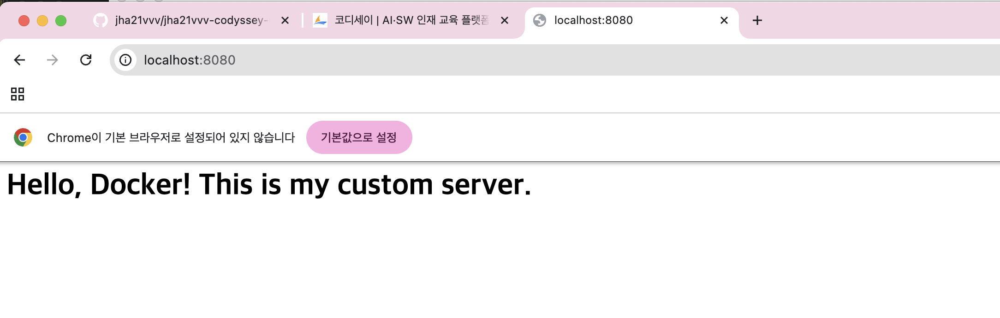
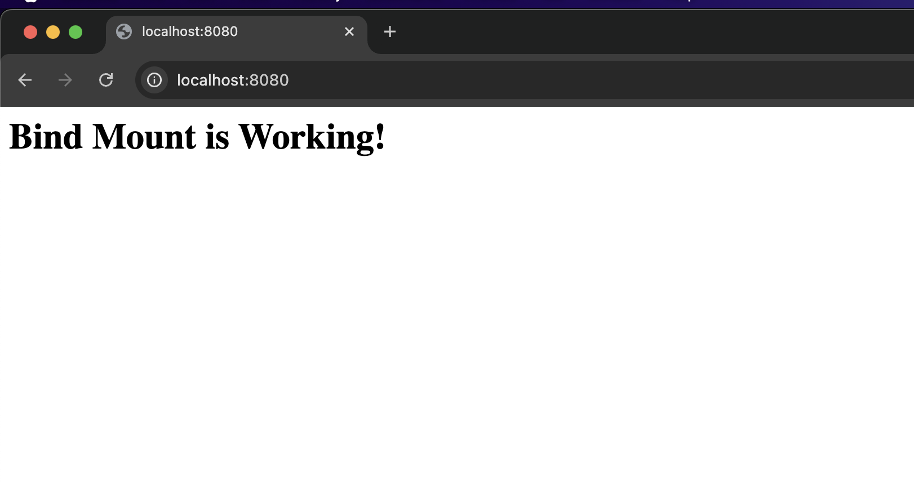
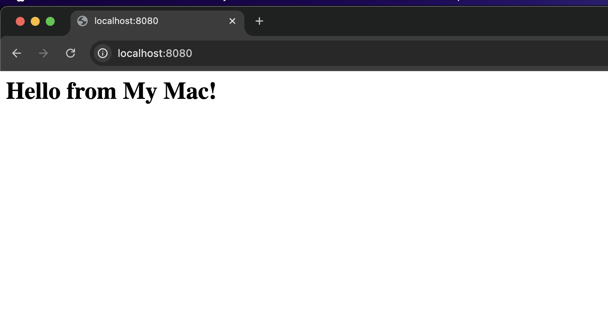

# 🚀 Docker & Git 개발 워크스테이션 구축 보고서

## 1. 프로젝트 개요
- **미션 목표**: 터미널 조작, Git 설정, Docker 컨테이너 운영 및 커스텀 이미지 제작 실습.

## 2. 실행 환경
- **OS**: macOS
- **Shell**: zsh (맥 터미널 기본값)
- **Docker 버전**: version 28.5.2, build ecc6942
- **Git 버전**: it version 2.53.0

## 3. 수행 항목 체크리스트
- [x] GitHub 저장소 생성 및 Clone
- [x] 터미널 기본 조작 로그 기록 (요구사항 2)
- [x] 파일/디렉토리 권한 변경 실습 (요구사항 3)
- [x] Docker 설치 및 기본 점검 (요구사항 4)
- [x] Docker 기본 운영 명령 수행 (요구사항 5)
- [x] 컨테이너 실행 실습 (hello-world, ubuntu) (요구사항 6)
- [x] Dockerfile 기반 커스텀 이미지 제작 (요구사항 7)
- [x] 포트 매핑 및 볼륨 영속성 검증 (요구사항 8, 9)
- [x] Git 설정 및 GitHub 연동 (요구사항 10)
- [x] 트러블 슈팅 2건(요구사항 11)

---

## 4. 검증 방법 및 결과 (터미널 로그)

### GitHub 저장소 생성 및 Clone (요구사항1): 현 파일

### 4. 터미널 조작 및 권한 실습
> **검증 방법**: `ls`, `chmod` 등의 명령어를 통해 파일 생성 및 권한 변경 확인
```bash
# 터미널 기본 조작 로그 기록 (요구사항 2): 깃버전, 현재 위치, 위치 이동, 파일생성, 파일에 입력, 파일내용 확인, 파일복제, 파일 이름변경
jha21vvv5332@c6r6s5 jha21vvv-codyssey-01 % git --version
git version 2.53.0
jha21vvv5332@c5r9s4 jha21vvv-codyssey-01 % pwd 
/Users/jha21vvv5332/workspace/jha21vvv-codyssey-01
jha21vvv5332@c5r9s4 jha21vvv-codyssey-01 % mkdir workspace
jha21vvv5332@c5r9s4 jha21vvv-codyssey-01 % cd workspace
jha21vvv5332@c5r9s4 workspace % pwd     
/Users/jha21vvv5332/workspace/jha21vvv-codyssey-01/workspace
jha21vvv5332@c5r9s4 workspace % touch test.txt
jha21vvv5332@c5r9s4 workspace % echo "Hello Git" > test.txt
jha21vvv5332@c5r9s4 workspace % cat test.txt
Hello Git
jha21vvv5332@c5r9s4 workspace % cp test.txt copy.txt
jha21vvv5332@c5r9s4 workspace % mv copy.txt renamed.txt
# -a는 모든걸 의미함. 올
jha21vvv5332@c5r9s4 workspace % ls -a 
.               ..              renamed.txt     test.txt
jha21vvv5332@c5r9s4 workspace % rm renamed.txt
jha21vvv5332@c5r9s4 workspace % ls -a 
.               ..              test.txt
# 파일/디렉토리 권한 변경 실습 (요구사항 3): 읽기전용으로 파일 권한 변경 -l:리스트라는 뜻
jha21vvv5332@c5r9s4 workspace % ls -l test.txt
-rw-r--r--  1 jha21vvv5332  jha21vvv5332  10 Jul 27 19:42 test.txt
jha21vvv5332@c5r9s4 workspace % chmod 444 test.txt
jha21vvv5332@c5r9s4 workspace % ls -l test.txt
-r--r--r--  1 jha21vvv5332  jha21vvv5332  10 Jul 27 19:42 test.txt
# 소유자, 같은 그룹의 사용자들, 일반 사용자
```


### 5. Docker 기본 운영 및 6. 실습
```bash
# Docker 설치 및 기본 점검 (요구사항 4): 버전확인, 도커 정보 출력
jha21vvv5332@c5r9s4 workspace % docker --version
Docker version 28.5.2, build ecc6942
jha21vvv5332@c5r9s4 workspace % docker info 
Client:
 Version:    28.5.2
 Context:    orbstack
 Debug Mode: false
 Plugins:
  buildx: Docker Buildx (Docker Inc.)
    Version:  v0.29.1
    Path:     /Users/jha21vvv5332/.docker/cli-plugins/docker-buildx
  compose: Docker Compose (Docker Inc.)
    Version:  v2.40.3
    Path:     /Users/jha21vvv5332/.docker/cli-plugins/docker-compose

Server:
 Containers: 0
  Running: 0
  Paused: 0
  Stopped: 0
 Images: 0
 Server Version: 28.5.2
 Storage Driver: overlay2
  Backing Filesystem: btrfs
  Supports d_type: true
  Using metacopy: false
  Native Overlay Diff: true
  userxattr: false
 Logging Driver: json-file
 Cgroup Driver: cgroupfs
 Cgroup Version: 2
 Plugins:
  Volume: local
  Network: bridge host ipvlan macvlan null overlay
  Log: awslogs fluentd gcplogs gelf journald json-file local splunk syslog
 CDI spec directories:
  /etc/cdi
  /var/run/cdi
 Swarm: inactive
 Runtimes: io.containerd.runc.v2 runc
 Default Runtime: runc
 Init Binary: docker-init
 containerd version: 1c4457e00facac03ce1d75f7b6777a7a851e5c41
 runc version: d842d7719497cc3b774fd71620278ac9e17710e0
 init version: de40ad0
 Security Options:
  seccomp
   Profile: builtin
  cgroupns
 Kernel Version: 6.17.8-orbstack-00308-g8f9c941121b1
 Operating System: OrbStack
 OSType: linux
 Architecture: x86_64
 CPUs: 6
 Total Memory: 15.67GiB
 Name: orbstack
 ID: ab86dd11-6c99-43b8-a645-cdb53c3916b6
 Docker Root Dir: /var/lib/docker
 Debug Mode: false
 Experimental: false
 Insecure Registries:
  ::1/128
  127.0.0.0/8
 Live Restore Enabled: false
 Product License: Community Engine
 Default Address Pools:
   Base: 192.168.97.0/24, Size: 24
   Base: 192.168.107.0/24, Size: 24
   Base: 192.168.117.0/24, Size: 24
   Base: 192.168.147.0/24, Size: 24
   Base: 192.168.148.0/24, Size: 24
   Base: 192.168.155.0/24, Size: 24
   Base: 192.168.156.0/24, Size: 24
   Base: 192.168.158.0/24, Size: 24
   Base: 192.168.163.0/24, Size: 24
   Base: 192.168.164.0/24, Size: 24
   Base: 192.168.165.0/24, Size: 24
   Base: 192.168.166.0/24, Size: 24
   Base: 192.168.167.0/24, Size: 24
   Base: 192.168.171.0/24, Size: 24
   Base: 192.168.172.0/24, Size: 24
   Base: 192.168.181.0/24, Size: 24
   Base: 192.168.183.0/24, Size: 24
   Base: 192.168.186.0/24, Size: 24
   Base: 192.168.207.0/24, Size: 24
   Base: 192.168.214.0/24, Size: 24
   Base: 192.168.215.0/24, Size: 24
   Base: 192.168.216.0/24, Size: 24
   Base: 192.168.223.0/24, Size: 24
   Base: 192.168.227.0/24, Size: 24
   Base: 192.168.228.0/24, Size: 24
   Base: 192.168.229.0/24, Size: 24
   Base: 192.168.237.0/24, Size: 24
   Base: 192.168.239.0/24, Size: 24
   Base: 192.168.242.0/24, Size: 24
   Base: 192.168.247.0/24, Size: 24
   Base: fd07:b51a:cc66:d000::/56, Size: 64

WARNING: DOCKER_INSECURE_NO_IPTABLES_RAW is set
##Docker 기본 운영
# 내 컴퓨터에 설치된 프로그램 설치 파일(설계도) 리스트 보기
# >>> 추가 해석: 이미지는 "내가 설정한 환경을 그대로 떠놓은 스냅샷(Snapshot)" 
jha21vvv5332@c5r9s4 workspace % docker images
REPOSITORY   TAG       IMAGE ID   CREATED   SIZE
#Docker가 내 컴퓨터에서 제대로 작동하는지 확인하는 가장 표준적인 테스트 명령어
jha21vvv5332@c5r9s4 workspace % docker run hello-world
Unable to find image 'hello-world:latest' locally
latest: Pulling from library/hello-world
4f55086f7dd0: Pull complete 
Digest: sha256:c3cbe1cc1aa588a64951ac6286e0df7b27fe2e6324b1001c619bb358770c0178
Status: Downloaded newer image for hello-world:latest

Hello from Docker!
This message shows that your installation appears to be working correctly.

To generate this message, Docker took the following steps:
 1. The Docker client contacted the Docker daemon.
 2. The Docker daemon pulled the "hello-world" image from the Docker Hub.
    (amd64)
 3. The Docker daemon created a new container from that image which runs the
    executable that produces the output you are currently reading.
 4. The Docker daemon streamed that output to the Docker client, which sent it
    to your terminal.

To try something more ambitious, you can run an Ubuntu container with:
 $ docker run -it ubuntu bash

Share images, automate workflows, and more with a free Docker ID:
 https://hub.docker.com/

For more examples and ideas, visit:
 https://docs.docker.com/get-started/
# 컨테이너 목록 수정
# 내 컴퓨터에 존재하는 모든 컨테이너의 목록과 상태를 보여줘!라는 명령어, ps는 현재 상태, -a는 전부
jha21vvv5332@c5r9s4 workspace % docker ps -a
CONTAINER ID   IMAGE         COMMAND    CREATED         STATUS                     PORTS     NAMES
221c5fd86797   hello-world   "/hello"   6 seconds ago   Exited (0) 6 seconds ago             sleepy_villani
#	이미지를 활용해서 도커 창조
# 실행해!-컨테이너 안으로 들어가서 키보드로 명령어를 입력하고 결과를 화면으로 보여줘-'my-ubuntu'라는 이름을 붙여-ubuntu라는 운영체제 이미지를 사용해-컨테이너가 켜지자마자 실행할 프로그램
jha21vvv5332@c5r9s4 workspace % docker run -it --name my-ubuntu ubuntu bash
Unable to find image 'ubuntu:latest' locally
latest: Pulling from library/ubuntu
ed819469700f: Pull complete 
a3679419df18: Pull complete 
Digest: sha256:3131b4cc82a783df6c9df078f86e01819a13594b865c2cad47bd1bca2b7063bb
Status: Downloaded newer image for ubuntu:latest
root@b47e3dafa4c0:/# ls
echo "hello from ubuntu"
exit
bin  boot  dev  etc  home  lib  lib64  media  mnt  opt  proc  root  run  sbin  srv  sys  tmp  usr  var
hello from ubuntu
exit
jha21vvv5332@c5r9s4 workspace % docker ps -a
CONTAINER ID   IMAGE         COMMAND    CREATED          STATUS                      PORTS     NAMES
b47e3dafa4c0   ubuntu        "bash"     31 seconds ago   Exited (0) 17 seconds ago             my-ubuntu
221c5fd86797   hello-world   "/hello"   57 seconds ago   Exited (0) 57 seconds ago             sleepy_villani
   
```

### 7. Docker커스텀 이미지 제작 8. 포트 매핑
### 선택한 베이스 이미지: nginx:latest
### 커스텀 포인트: 기본 index.html 파일을 내가 만든 파일로 교체함.
### 목적: Docker를 이용해 정적 웹 페이지를 서비스하는 커스텀 서버 구축.
```bash
# 서버 만들고 그 서버 폴더에 헬로도커 입력, 
jha21vvv5332@c5r9s4 workspace % mkdir my-web-server
jha21vvv5332@c5r9s4 workspace % cd my-web-server
jha21vvv5332@c5r9s4 my-web-server % echo "<h1>Hello, Docker! This is my custom server.</h1>" > index.html
# 도커 파일에 nginx라는 웹 서버 이미지로 만들어둠. 인덱스 파일을 도커의 이미지(nginx)에 따라 붙임.
jha21vvv5332@c5r9s4 my-web-server % touch Dockerfile
# 위의 내용을 나만의 이미지로 하여 저장
# 코드 추가설명: t는 생성할 도커 이미지에 '이름(태그)'을 붙여주는 옵션, my-web-app라고 이름 붙여주는 셈.
jha21vvv5332@c5r9s4 my-web-server % docker build -t my-web-app .
[+] Building 7.9s (7/7) FINISHED                                                                                                                                                                                                                          docker:orbstack
 => [internal] load build definition from Dockerfile                                                                                                                                                                                                                 0.2s
 => => transferring dockerfile: 219B                                                                                                                                                                                                                                 0.0s
 => [internal] load metadata for docker.io/library/nginx:latest                                                                                                                                                                                                      2.5s
 => [internal] load .dockerignore                                                                                                                                                                                                                                    0.1s
 => => transferring context: 2B                                                                                                                                                                                                                                      0.0s
 => [internal] load build context                                                                                                                                                                                                                                    0.3s
 => => transferring context: 87B                                                                                                                                                                                                                                     0.0s
 => [1/2] FROM docker.io/library/nginx:latest@sha256:5a88c9c45479443d7be2eadc894b4ed0a9801bae03d97a5760ae13b5c2005942                                                                                                                                                4.0s
 => => resolve docker.io/library/nginx:latest@sha256:5a88c9c45479443d7be2eadc894b4ed0a9801bae03d97a5760ae13b5c2005942                                                                                                                                                0.2s
 => => sha256:5a88c9c45479443d7be2eadc894b4ed0a9801bae03d97a5760ae13b5c2005942 10.23kB / 10.23kB                                                                                                                                                                     0.0s
 => => sha256:db4f612f385437d11eb26620a4f1d7efb3ff44e1296a3c21540b30454e6e2bf3 2.29kB / 2.29kB                                                                                                                                                                       0.0s
 => => sha256:4e5db4761e0ff445f7fd29aad680ad28e8abf7d204895557f145d65535abcc1c 9.09kB / 9.09kB                                                                                                                                                                       0.0s
 => => sha256:82454cdbf456a77f9ff1bb88b121c2a739e38c30ea689c135c7cca6249eabe4e 33.33MB / 33.33MB                                                                                                                                                                     0.8s
 => => sha256:062e450697faa5f02a3a74eba9864ee4d79bc9cfbd65769fc6cdff2c05c6a053 29.78MB / 29.78MB                                                                                                                                                                     0.6s
 => => sha256:3c7ab7949321f47c96fc0918f9f72e8f51bd452cdef1e0dad9599880317380b9 626B / 626B                                                                                                                                                                           0.7s
 => => sha256:cacfcdd01f309c65d69372716e799ea741065ac1b1e60880b3a6981ae105cb55 955B / 955B                                                                                                                                                                           0.9s
 => => extracting sha256:062e450697faa5f02a3a74eba9864ee4d79bc9cfbd65769fc6cdff2c05c6a053                                                                                                                                                                            1.1s
 => => sha256:b6698f04e005497a7f495c0719358d43890cb3997ad7b4ab0b06748247c574a3 403B / 403B                                                                                                                                                                           0.9s
 => => sha256:2bedaf25031a24fb70b9dc2d56cb17139186d1ae5fd2054ecbd0dfe1a69585ba 1.21kB / 1.21kB                                                                                                                                                                       1.1s
 => => sha256:d26f27cc8c41e321394cb3c9a80915d90d5f1f1d3cbbbcda3be00f13c53b041e 1.40kB / 1.40kB                                                                                                                                                                       1.2s
 => => extracting sha256:82454cdbf456a77f9ff1bb88b121c2a739e38c30ea689c135c7cca6249eabe4e                                                                                                                                                                            0.7s
 => => extracting sha256:3c7ab7949321f47c96fc0918f9f72e8f51bd452cdef1e0dad9599880317380b9                                                                                                                                                                            0.0s
 => => extracting sha256:cacfcdd01f309c65d69372716e799ea741065ac1b1e60880b3a6981ae105cb55                                                                                                                                                                            0.0s
 => => extracting sha256:b6698f04e005497a7f495c0719358d43890cb3997ad7b4ab0b06748247c574a3                                                                                                                                                                            0.0s
 => => extracting sha256:2bedaf25031a24fb70b9dc2d56cb17139186d1ae5fd2054ecbd0dfe1a69585ba                                                                                                                                                                            0.0s
 => => extracting sha256:d26f27cc8c41e321394cb3c9a80915d90d5f1f1d3cbbbcda3be00f13c53b041e                                                                                                                                                                            0.0s
 => [2/2] COPY index.html /usr/share/nginx/html/index.html                                                                                                                                                                                                           0.4s
 => exporting to image                                                                                                                                                                                                                                               0.2s
 => => exporting layers                                                                                                                                                                                                                                              0.1s
 => => writing image sha256:c68389fb37be02999ca9365b3475f6807fbfc17ab56d98e5d081a168c570b39a                                                                                                                                                                         0.0s
 => => naming to docker.io/library/my-web-app 

# 컨테이너 내부와 외부의 포트를 연결하여 출력할수 있는 환경을 만들어줌.
# 코드 설명: 컨테이너는 백그라운드로 가동-내 컴퓨터의 8080포트로 들어오면 컨테이너의 80포트로 보내주라는 이야기-실행될 컨테이너 이름-사용될 이미지 이름
jha21vvv5332@c5r9s4 my-web-server % docker run -d -p 8080:80 --name my-running-app my-web-app
ecc8e64eb3f08c015ff3ef464a7856dd507082ec05d3cbfb2c07b743229c5373
jha21vvv5332@c5r9s4 my-web-server % curl localhost:8080
<h1>Hello, Docker! This is my custom server.</h1>
```



### 9. Docker 볼륨 영속성 검증
- **절차:** 볼륨 생성 -> 컨테이너1에서 파일 생성 -> 컨테이너1 삭제 -> 컨테이너2에서 동일 볼륨 연결 후 파일 확인
- **명령어 및 결과:**
```bash
# 볼륨 생성
jha21vvv5332@c5r9s4 my-web-server % docker volume create my-db-vol
my-db-vol

# 컨테이너1에서 데이터 작성 후 삭제
# 코드 해석: 컨테이너를 만들고 바로 실행해줘---i (interactive): 사용자가 입력을 할 수 있게 상태를 유지-t (tty): 터미널 화면(검은 창)을 제공-컨테이너의 이름을 container1이라고 지어줄게
# -내 도커 볼륨인 my-db-vol을 컨테이너 안의 /mnt/data 폴더와 연결해줘-내 도커 볼륨인 my-db-vol을 컨테이너 안의 /mnt/data 폴더와 연결해줘
jha21vvv5332@c5r9s4 my-web-server % docker run -it --name container1 -v my-db-vol:/mnt/data ubuntu bash
root@980e1d4fb8b8:/# echo "This data will survive!" > /mnt/data/test.txt
ls /mnt/data
exit
test.txt
exit
jha21vvv5332@c5r9s4 my-web-server % docker rm container1
container1


# 컨테이너2에서 데이터 복구 확인
jha21vvv5332@c5r9s4 my-web-server % docker run -it --name container2 -v my-db-vol:/mnt/data ubuntu bash
root@56443a6b8b75:/# cat /mnt/data/test.txt
This data will survive!
```


#### 9.1. 바인드 마운트 테스트
```bash
###테스트를 위한 파일 생성
jha21vvv5332@c6r5s1 mkdir bind-mount-test
###해당위치로 이동
jha21vvv5332@c6r5s1 cd bind-mount-test
###바인드 마운트 테스트용 설정
#코드 해석: 백그라운드에서 실행해줘!"-컨테이너 이름을 my-bind-server로 정해- 현재 내가 위치한 폴더의 전체 경로를 자동으로 입력해주는 명령어- :왼쪽(내 컴퓨터 폴더)과 오른쪽(컨테이너 안의 폴더)을 연결함
#  -Nginx 서버가 웹 페이지 파일(index.html 등)을 찾는 기본 경로Nginx 서버가 웹 페이지 파일(index.html 등)을 찾는 기본 경로- 사용할 이미지 이름
jha21vvv5332@c6r5s1 bind-mount-test % docker run -d \
  -p 8080:80 \
  --name my-bind-web \
  -v $(pwd):/usr/share/nginx/html \
  nginx
Unable to find image 'nginx:latest' locally
latest: Pulling from library/nginx
062e450697fa: Pull complete 
82454cdbf456: Pull complete 
3c7ab7949321: Pull complete 
cacfcdd01f30: Pull complete 
b6698f04e005: Pull complete 
2bedaf25031a: Pull complete 
d26f27cc8c41: Pull complete 
Digest: sha256:5a88c9c45479443d7be2eadc894b4ed0a9801bae03d97a5760ae13b5c2005942
Status: Downloaded newer image for nginx:latest
3706739a3c337a076d6101dfa7f7abc5d0d49ea10c0d4fb9d7b7337b4119cdcb

### 바인드 마운트 테스트로 일단 입력



jha21vvv5332@c6r5s1 bind-mount-test % echo '<h1>Bind Mount is Working!</h1>' > index.html

### 바인드 마운트 테스트용 변경된것 확인



jha21vvv5332@c6r5s1 bind-mount-test % echo '<h1>Hello from My Mac!</h1>' > index.html
```

#### 10. Git 설정 및 GitHub 연동과 보안 및 개인정보 보호

```bash
##자주 쓰는 깃전용 
#이름
#코드해석: 역할: Git에서 사용할 사용자 이름을 설정합니다.
jha21vvv5332@c5r9s4 workspace % git config --global user.name "jha21vvv"
#아이디로 일단 접속할곳
jha21vvv5332@c5r9s4 workspace % git config --global user.email "___개인정보"
#깃허브의 클론 파일 만들기
git clone https://github.com/본인의계정명/저장소이름.git
# 복제한 폴더 안으로 들어갑니다
cd 저장소이름
#도커 연결 확인
docker ps
#VS Code에서 폴더 열기
code .
#깃관련 정보
jha21vvv5332@c5r9s4 workspace % git config --list
credential.helper=osxkeychain
user.name=jha21vvv
user.email=개인정보
init.defaultbranch=main
core.repositoryformatversion=0
core.filemode=true
core.bare=false
core.logallrefupdates=true
core.ignorecase=true
core.precomposeunicode=true
remote.origin.url=https://github.com/jha21vvv/jha21vvv-codyssey-01.git
remote.origin.fetch=+refs/heads/*:refs/remotes/origin/*
branch.main.remote=origin
branch.main.merge=refs/heads/main
branch.main.vscode-merge-base=origin/main
:
credential.helper=osxkeychain
user.name=jha21vvv
user.email=개인정보
init.defaultbranch=main
core.repositoryformatversion=0
core.filemode=true
core.bare=false
core.logallrefupdates=true
core.ignorecase=true
core.precomposeunicode=true
remote.origin.url=https://github.com/jha21vvv/jha21vvv-codyssey-01.git
remote.origin.fetch=+refs/heads/*:refs/remotes/origin/*
branch.main.remote=origin
branch.main.merge=refs/heads/main
branch.main.vscode-merge-base=origin/main
:

#### 깃 변경사항 업데이트하여 업데이트하기
#변경사항 바구니에 담기
git add .
#  커밋 메시지와 함께 저장
git commit -m "first feedback"
# 커밋 메시지와 함께 저장
git push origin main
```
### 10.1. 개인정보 보호를 위한 브랜치 리뉴얼: 기존 버전에 이메일이 적힌걸보고 지웠으나 히스토리에 남아있기에 히스토리전부 지우기위하여 실행
```bash
#1. 새로운 임시 브랜치 만들기 (히스토리 없이 시작)
git checkout --orphan latest_branch
#2. 모든 파일 추가 및 첫 커밋
git add -A
git commit -m "Initial commit (Final version)"
#3. 기존의 main 브랜치 삭제하기
git branch -D main
#4. 현재 브랜치 이름을 main으로 바꾸기
git branch -m main
#5. GitHub에 강제로 덮어쓰기 (중요!)
git push -f origin main
```

### 11. 트러블 슈팅-1번째건: 깃연동과정에서 파일의 위치를 찾지 못하는 실수
```bash
####### 요약:: 
####문제: 위치 오류로 README.md가 깃에 안올라간 상황이 나옴. 
####원인: 터미널에서의 인식하는 위치에 README.md파일이 없음
####결과: README.md의 위치 파악후 올림.
### git push origin main 입력후 확인결과 깃 jha21vvv-codyssey-01에 README.md에 jha21vvv-codyssey-01라는 텍스트만 적혀있음.
### 해결방식 일단 네이토로 상황 분석에 도움 요청
### 네이토 답변"**내 컴퓨터(VSCode)에서 수정한 내용을 GitHub 서버로 보내주는 과정(Push)**을 아직 안 했기 때문이에요. 아래 순서대로 따라 해서 작성한 내용을 GitHub에 반영해 봅시다!"
### 제시된 아래코드 터미널에 입력
git add README.md
git commit -m "Docker 및 Git 실습 내용 추가"
git push origin main
### 터미널에서 아래코드 나온 후, 깃의 README.md에 jha21vvv-codyssey-01라는 텍스트만 적혀있음. 해당 내용 네이토에 재입력
jha21vvv5332@c5r9s4 my-web-server % git add README.md
fatal: pathspec 'README.md' did not match any files
jha21vvv5332@c5r9s4 my-web-server % 
###네이토 답변 "아하, 에러가 난 이유는 현재 터미널의 위치가 my-web-server 폴더 안쪽인데, README.md 파일은 그 바깥쪽(상위 폴더)에 있기 때문이에요! 컴퓨터에게 "여기서 README.md 찾아줘!" 했는데, 그 방 안에는 없어서 당황한 상태입니다." 아래코드 제시하여 입력
ls
cd ..
ls
git add README.md
git commit -m "Docker 및 Git 실습 내용 추가"
git push origin main
### 2차 터미널 내용 아래와 같이 나옴
jha21vvv5332@c5r9s4 my-web-server % ls
Dockerfile      index.html
jha21vvv5332@c5r9s4 my-web-server % cd ..
jha21vvv5332@c5r9s4 workspace % Is
zsh: command not found: Is
jha21vvv5332@c5r9s4 workspace % ls      
my-web-server   test.txt
### 워크스페이스에 없음.
### 네이토 답변 "지금 ls를 했을 때 안 보인다는 건, VSCode 화면에는 떠 있지만 실제로는 다른 폴더에 저장되어 있을 가능성이 커요."
git status
### 터미널 결과는 아래와 같음.
jha21vvv5332@c5r9s4 workspace % git status
On branch main
Your branch is up to date with 'origin/main'.

Changes not staged for commit:
  (use "git add <file>..." to update what will be committed)
  (use "git restore <file>..." to discard changes in working directory)
        modified:   ../README.md

Untracked files:
  (use "git add <file>..." to include in what will be committed)
        test.txt

no changes added to commit (use "git add" and/or "git commit -a")
### 네이토 답변" modified: ../README.md 라고 되어 있죠? 여기서 ../는 **"현재 위치보다 한 단계 위 폴더에 파일이 있다"**는 뜻입니다. 즉, 지금 터미널 위치인 workspace 폴더 바로 바깥에 README.md가 살고 있는 거예요."
git add ../README.md
git commit -m "README.md 위치 수정 및 내용 업데이트"
git push origin main
### README.md 수정하여 깃에 업로드 완료
```


### 11. 트러블 슈팅-2번째건: 맥 pc처음사용에 따른 문제
```bash
#####요약: 
#### 문제: 맥 처음 사용에 따라, 복사붙여넣기, 스크린샷, 한영변환키, 화면전환등을 몰라서 별도로 2시간이상의 맥에 적응하는 시간 소요됨
#### 원인: 커맨드키를 기반으로 맥에서 단축키를 사용하는데 한영키와 한자 밑에 동일한 모양이 존재하나 그 기능은 다르며, 한영키가 작동하지 않아 네이토에게도 물을수 없었음
#### 해결: 휴대폰의 제미나이를 통해 한영변환후 필요한 단축키를 일단 배움.
```